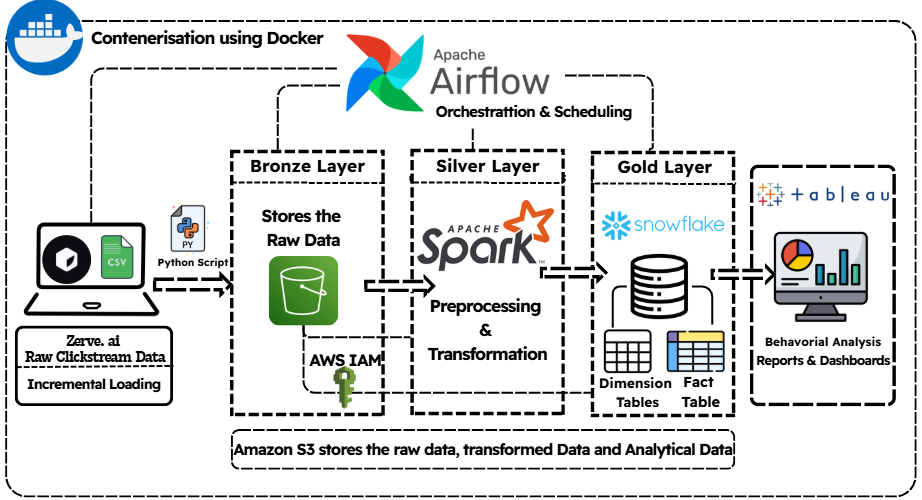
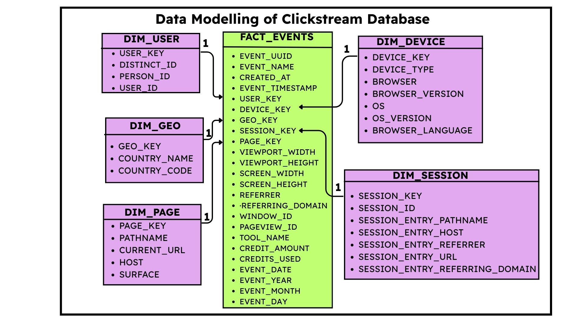

# ProductNerve
**ProductNerve** is a Data Engineering pipeline that _extracts, transforms and loads_ the Clickstream Data from the official data set made available by **Zerve. Ai.** This pipeline uses **Python, SQL, Apache Spark (PySpark), Apache Airflow, Amazon S3 (Data Lake), Docker Snowflake, Tableau.**

Tasks Performed by the pipeline:
- It loads the raw data from **Local Machine** to **AWS S3** using the Python Script. **[Bronze Layer]**
- It preprocess and performs **transformation on the data using PySpark and loads back to S3** **[Silver Layer]**
- Performs Data Modelling and creates the **Star Schema by creating fact and dimension tables by PySpark** **[Gold Layer]**
- Tables are loaded into **Snowflake by AWS integration** is used further Analytics
- **Orchestration** is performed by Airflow 

# Datasource
The Datasource used in the project is taken from **Zerve. Ai website [link](https://uc.hackerearth.com/he-public-ap-south-1/zerve_hackathon_for_reviewc8fa7c7.csv)**, where the Dataset was made public for the analysis purpose and also used as a resource in Hackearth Hackathon.

It contains:
- **409k Posthog events (ClickStream Data)** performed by the users and **107 Columns** to map the specific details.
- It contains the columns which contains: **User, Device, Session, Page, Demographic details** for the event performed

Post understanding the Data the aim is to
- Find the **granularity of the data** ( user events).
- Think about the **business questions** this Data can answer, would help in Data Modelling.
- Remove the unwanted columns which would not be used for analysis (Silver Layer).
- Perform **normalisation** (Silver Layer) .
- Create a **Star Schema** in Snowflake (Gold Layer)

# Tech Stack
- **Programming Language:** Python, SQL
- **Data Storage:** AWS S3 (S3 Bucket)
- **Data Processing & Transformation:** Apache Spark (PySpark)
- **Workflow Orchestration:** Apache Airflow
- **Warehouse:** Snowflake
- **Architecture:** Medallion (Bronze–Silver–Gold), Star Schema

# Pipeline Architecture

# Data Model

# Setting up the Airflow Pipeline
- Create an **AWS Account and a S3 bucket** (AWS asks for Credentials of Bank, at first you might be hesitant about it but with correct guidance from youtube, you would be able to learn better, Research on billing is recommended ). [link](https://youtu.be/5MRTCayjzQk?si=i6lIxaXdLX4i2auB)
- Once S3 is Created, generate an **AWS Access Key and Secret Access Key.** [link](https://youtu.be/GqPnkZoEXVo?si=AtstchiluQ75vDVQ)
- Login in Snowflake and generate the**Snowflake Credentials.** [link](https://youtu.be/duKRs0Hsdyk?si=zrc8p-t-3m8YNiQE)
- Set up a .env file because you would store up all the AWS Credentials, Snowflake Credentials inside it ( Have Uploaded a reference .env file).
- In the Data Folder Upload the Downloaded File (Dataset) from the above mentioned Zerve. Ai website. [link for Dataset](https://uc.hackerearth.com/he-public-ap-south-1/zerve_hackathon_for_reviewc8fa7c7.csv)
- Run the **Docker-compose.yml** using "docker compose up --build" command
- Open **Airflow UI in Local host:8080** in the web browser (username: airflow password: airflow)
- In airflow configure the spark connection [link incase it helps](https://youtu.be/L3VuPnBQBCM?si=CHmeBH3xt1K2tv8H)
--**Connection Id:** spark_default
--**Connection type:** Spark
--**Host:** local
--**Extra:** {"queue": "root.default"}
- Trigger the DAG, will be able to see the 3 Tasks Running
- If you ever get stuck and DAG Fails, always open the details and go to the details of the Task, would be able to find the discrepancies.
**Understand the Process behind each Script**, if you follow up till here you will have a successful pipeline running, if not a **great Debugging Session** which will make you a better Data Engineer. **Happy Coding!!!**

# Improvements
- Implementation of **error handling/ retry logic.**
- Better **Monitoring (Email Triggers)** can be implemented
- **Cluster mode** in Pyspark for large amounts of Data.
- **Visualisation** using Tableau

# Conclusion:
- This project gave us the understanding of the pipeline, if this has sparked the curiosity in you about Data Engineering, you can connect with me.
Linkedin : [Vishwajeet Rupnar](https://www.linkedin.com/in/vishwajeetrupnar)
- I would Love to hear back from each one worked on this project, if any addition required for better understanding, do let me know. _Happy Placements!!_

